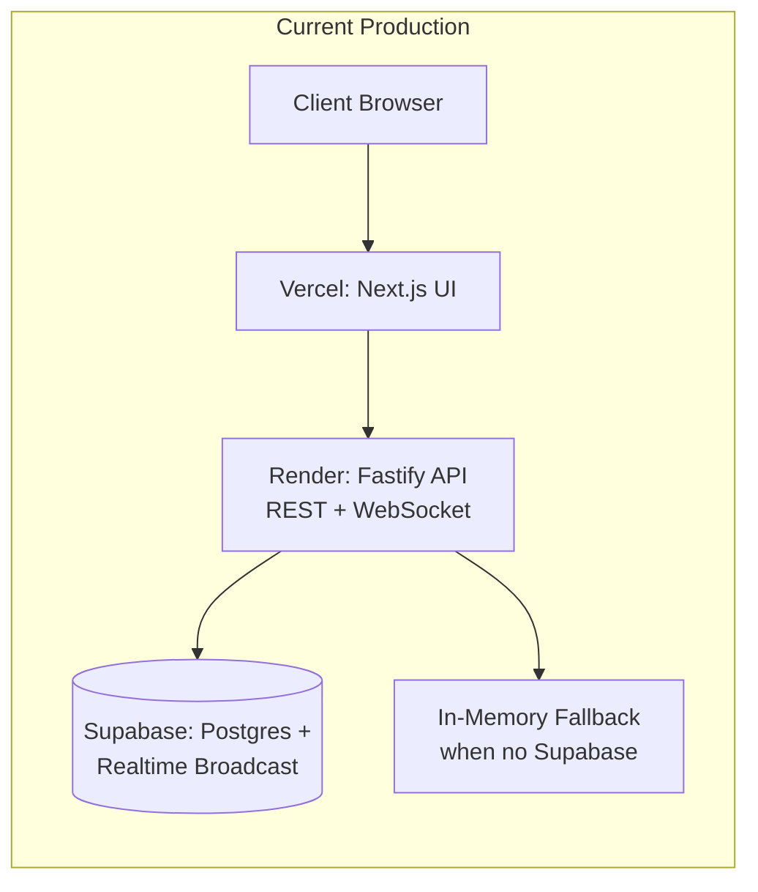
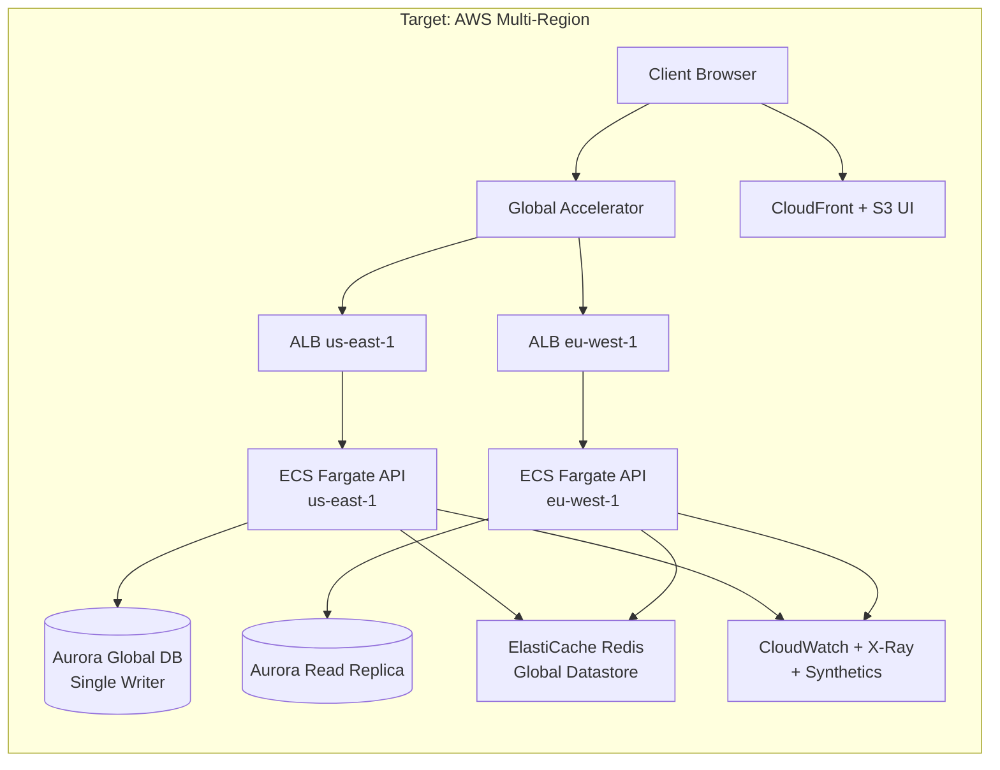

# ADR-0002: Deployment strategy and API architecture — current state and target evolution

> **Reading path: start here** · This document explains the current implementation and the target AWS architecture.
> Next → [`docs/adr/0003-reliability-governance-and-sla-verification.md`](0003-reliability-governance-and-sla-verification.md)

## Status

Accepted

## Date

2026-05-13

## Context

Chat App is a single-room realtime chat with **Name Reservation**, **Message Order**, and **Single Active Session Policy** as core domain invariants.

### Current implementation (validated against code)

- **UI App**: Next.js App Router (packaged as `@chat-app/web`)
- **API App**: Fastify with REST + WebSocket (packaged as `@chat-app/api`)
- **Shared Contract Package**: TypeScript interfaces only, no Zod (`@chat-app/contracts`)
- **Message History Store**: in-memory by default; Supabase-backed when `SUPABASE_URL` and `SUPABASE_ANON_KEY` env vars are set
- **Realtime Gateway**: in-memory by default; Supabase broadcast when env vars set
- **Presence Projection**: in-memory by default; Supabase broadcast when env vars set
- **Session identity**: httpOnly cookie plus `x-chat-session-id` header fallback
- **Handle reclaim window**: 5-minute in-memory reservation after disconnect
- **Active connection enforcement**: single WebSocket per identity; old socket gets `chat/replaced` event

Current deploy path (when deployed):
- UI on Vercel, API on Render.com, optional Supabase for persistence

### Architecture snapshots

## Decision

### 1) AWS-only deployment blueprint (target)

Adopt an AWS-only target architecture focused on 99.99% availability:

- Multi-region, active-active traffic topology for application tier
- Single global public hostname for clients
- AWS Global Accelerator in front of regional ALBs for traffic steering and failover
- **API App** on ECS Fargate behind ALB with WebSocket upgrade support
- **UI App** hosted on AWS with CloudFront + S3 for static assets and ECS-backed dynamic services
- Durable system of record: Aurora PostgreSQL Global Database
- Global write strategy: single-writer topology with cross-region failover
- Realtime coordination and fanout backbone: ElastiCache for Redis (multi-AZ + global datastore)
- Strict write admission control during writer failover windows to protect consistency
- Secrets management via AWS Secrets Manager + KMS
- Deployment safety via blue/green rollout and automatic rollback on SLO breach

- Mandatory edge protection with AWS Shield Advanced and AWS WAF (rate and bot controls)

Rationale:

- Aligns with explicit long-term 99.99% availability objective
- Keeps platform ownership within AWS while avoiding third-party managed realtime vendors
- Preserves domain policy enforcement in the **API App** and **Shared Contract Package**
- Keeps client integration simple by avoiding region-aware client routing logic

### 2) API architecture and project structure

Adopt a modular monolith architecture for the **API App**:

- Transport layer: REST and WebSocket boundary handling
- Application layer: use-case orchestration (join, reconnect, send, reset)
- Domain layer: **Room** rules and invariants
- Infrastructure layer: persistence, realtime adapters, security/cookie handling, observability

Feature-oriented module structure should reflect domain vocabulary and keep domain rules centralized.

Rationale:

- Maintains MVP delivery speed while creating clear seams for scaling changes
- Minimizes rewrite risk when replacing local adapters (SQLite/in-memory) with shared AWS infrastructure (Aurora/Redis)
- Keeps transport concerns separate from domain policy enforcement

### 3) Single-writer decision for global data

For Aurora Global Database, choose single-writer rather than multi-writer.

Rationale:

- Protects deterministic **Message Order** semantics without cross-region conflict resolution complexity
- Keeps **Name Reservation** correctness straightforward under concurrent join attempts
- Simplifies enforcement of **Single Active Session Policy** and **Session Replacement**
- Reduces correctness and operability risk for an early active-active rollout

### 4) Availability and recovery targets

Set long-term target objectives:

- Availability target: 99.99%
- Recovery Time Objective (RTO): <= 1 minute
- Recovery Point Objective (RPO): near-zero

Rationale:

- Matches explicit priority that availability is the primary architecture driver
- Establishes measurable objectives for failover design and operational verification

### 5) SLA/SLO verification model

Use formal SLI/SLO governance with error budgets and automated release gates.

Verification stack and practices:

- AWS-native observability baseline: CloudWatch, X-Ray, Synthetics, centralized structured logs
- Domain-level synthetic participant journeys as primary SLA evidence source
- Weekly automated failover drills and monthly full game days
- Automated writer-region promotion with guarded health checks and admission control
- Reconnect-and-rehydrate model for WebSocket continuity across regions using **Bootstrap Response** (participant identity + recent messages) and **Recent Messages**
- Real-time SLO dashboards, weekly reliability reviews, and monthly SLA reporting

Rationale:

- Ensures SLA claims are tied to participant-visible domain flows rather than infra-only uptime
- Creates continuous proof of RTO/RPO readiness under realistic fault scenarios

### 6) Runtime routing and consistency policies

Adopt the following runtime policies for multi-region active-active operation:

- Non-writer regions proxy write operations server-side to the current writer region
- **Message History Store** reads use local regional replicas when healthy and within lag thresholds; otherwise fallback to writer region
- **Name Reservation** decisions are writer-region authoritative
- **Single Active Session Policy** coordination uses Redis global lease/lock semantics with TTL heartbeats and atomic compare-and-set on socket attach
- **Presence Count** semantics allow bounded staleness for resilience
- Canonical **Message Order** is assigned at writer commit time; client arrival order is non-authoritative
- Clients auto-reconnect with exponential backoff and jitter, then rehydrate from **Bootstrap Response**
- Failover recovery includes controlled admission with reconnect prioritization to reduce thundering herd risk
- Session security uses short-lived signed session tokens in addition to **Session Cookie**
- Token signing and validation use KMS-backed keys, regional public-key cache, and scheduled rotation

Rationale:

- Preserves deterministic domain correctness where strictness matters most (ordering, reservation, session ownership)
- Improves latency and resilience by using healthy local reads and controlled degradation behavior
- Keeps failover behavior predictable while protecting system stability under reconnect spikes

### 7) Security and resilience baseline

Adopt the following non-optional baseline controls:

- Encryption in transit and at rest for all production data paths
- Immutable audit logs for control-plane and high-risk runtime actions
- Explicit retention and lifecycle policies for logs, audit records, and operational telemetry
- Disaster recovery validation includes single-AZ failure, single-region failure, and control-plane degradation scenarios

Rationale:

- Availability targets are inseparable from security and control-plane integrity at 99.99%
- Immutable auditing and retention support post-incident analysis and SLA evidence quality

## Consequences

Positive:

- Provides a direct path to 99.99%-class architecture through multi-region active-active compute
- Improves resilience for realtime **Timeline** fanout and session coordination
- Keeps **Error Code** definitions and domain policies consistent across transports
- Enables incremental migration from current in-process/stateful implementation
- Introduces explicit operational discipline for reliability validation (error budgets, synthetic journeys, game days)

Tradeoffs:

- Higher platform and inter-region networking cost than single-region designs
- Higher operational complexity (regional failover, write-region promotion, cross-region observability)
- Single-writer topology can increase cross-region write latency for non-writer-region traffic
- Blue/green and strict control-plane workflows increase delivery/process overhead

## Alternatives considered

- Single stateful API node with SQLite only: simpler and cheap, but insufficient for long-term 99.99% goals.
- Third-party managed realtime provider + non-AWS app hosting: operationally attractive but does not match AWS-only preference.
- Early microservices split: rejected due to premature complexity and slower MVP iteration.

Platform alternative retained in docs:

- EKS is a valid alternative runtime to ECS Fargate for teams needing deeper Kubernetes control; not selected as default due to higher operational overhead for current team goals.

## Follow-up implementation direction

- Keep **Shared Contract Package** as source of wire contract truth.
- Refactor API internals toward modular monolith boundaries before major scaling work.
- Migrate durable message/history and reservation data to Aurora PostgreSQL.
- Introduce Redis-backed coordination for cross-instance session/presence rules and realtime fanout distribution.
- Define and test regional failover runbooks, including writer-region promotion.
- Implement synthetic journey checks for join/send/reconnect domain flows and wire them into deployment gates.
- Execute incremental rollout using `docs/availability-rollout-plan.md` as the canonical phase and gate plan.

---

**Continue reading → [`docs/adr/0003-reliability-governance-and-sla-verification.md`](0003-reliability-governance-and-sla-verification.md)** — SLI/SLO definitions, error budgets, and release gating.
