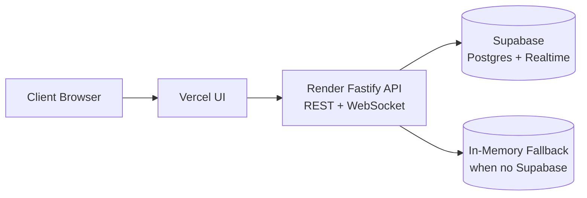
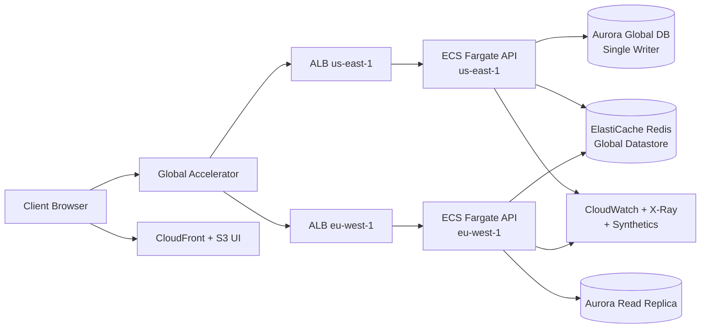
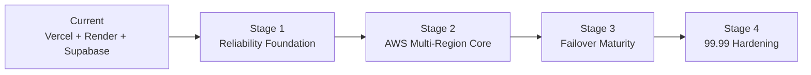

# 99.99 Availability Rollout Plan (Vercel/Render/Supabase → AWS)

> **Reading path: third (final)** · Before this, read [`docs/adr/0002-deployment-and-api-architecture.md`](adr/0002-deployment-and-api-architecture.md) and [`docs/adr/0003-reliability-governance-and-sla-verification.md`](adr/0003-reliability-governance-and-sla-verification.md).
> Historical reference (superseded): [`docs/adr/0001-vercel-supabase-target-architecture.md`](adr/0001-vercel-supabase-target-architecture.md)

## Purpose

This document explains the four-stage migration from the current Vercel/Render/Supabase stack to an AWS-only, SLO-driven architecture targeting 99.99% availability.  
It is written for readers with minimal project context — each stage explains *what changes* and *why*.

## One-minute architecture summary

| Aspect | Current state | Target state (end of Stage 4) |
|--------|--------------|-------------------------------|
| UI hosting | Vercel (Next.js) | CloudFront + S3 |
| API runtime | Render (Fastify REST + WebSocket) | ECS Fargate, multi-region |
| Durable data | Supabase Postgres (optional; in-memory fallback) | Aurora PostgreSQL Global Database |
| Realtime coordination | Supabase broadcast (optional; in-memory fallback) | ElastiCache Redis Global Datastore |
| Traffic routing | DNS-based, single-region | Global Accelerator + regional ALBs |
| Reliability governance | Implicit | Formal SLI/SLOs + error-budget gating |

### Current architecture

### Target architecture (end of Stage 4)

## Progression model

- Four stages, each with a defined scope and exit gate
- Do not advance a stage until all exit criteria are met
- Gates are based on measured availability and domain-correctness invariants (**Name Reservation**, **Message Order**, **Single Active Session Policy**)

## Stage 1: Reliability foundation

### What stays / what changes
- **Stays**: current Vercel/Render/Supabase production stack
- **Changes**: add observability, SLO definitions, runbooks, and synthetic checks *around* the existing stack

### Scope

- Establish observability baseline (CloudWatch, X-Ray, Synthetics, structured logs)
- Define SLI/SLOs and error-budget policy
- Implement domain-level synthetic Participant journeys for join/send/reconnect validation
- Write regional failover runbooks and execute dry-run exercises

### Dependencies

- Baseline deployment automation and environment parity across production-like stacks
- Centralized metrics and log retention policy

### Exit gate

- 99.9% measured availability for 30 consecutive days
- Synthetic journey pass rate >= 99.95%
- Failover runbook dry-run completed and documented

## Stage 2: Multi-region active-active core

### What changes from Stage 1

- **Main cutover**: API runtime moves from Render to ECS Fargate; data moves from Supabase to Aurora; coordination moves to Redis
- Single-region → multi-region active-active topology
- UI remains on Vercel temporarily (AWS UI path validated but not forced)

### Scope

- Enable multi-region active-active application tier
- Adopt single global hostname with Global Accelerator + regional ALBs
- Deploy API runtime on ECS Fargate with WebSocket support
- Move durable data to Aurora PostgreSQL Global Database with single-writer strategy
- Introduce Redis global coordination for session ownership and fanout coordination
- Implement server-side write proxying from non-writer regions to writer region

### Dependencies

- Stage 1 SLO instrumentation and synthetic checks in place
- Migration plan for persistence and connection coordination

### Exit gate

- Successful unannounced regional failover drill under production-like load
- RTO <= 5 minutes during drill
- No invariant violations for **Name Reservation**, **Message Order**, or **Single Active Session Policy**
- Automatic rollback behavior validated

## Stage 3: Failover maturity

### What changes from Stage 2

- Shift from "it works" to "it recovers predictably under pressure"
- Reduce failover and reconnect risk under realistic load patterns

### Scope

- Tighten failover automation and admission control
- Enforce reconnect prioritization and thundering-herd controls
- Mature read routing policy (healthy local replica reads with lag thresholds and writer fallback)
- Operationalize weekly automated failover drills and reliability reviews

### Dependencies

- Stable Stage 2 multi-region operations
- Automated regional writer promotion safeguards

### Exit gate

- Availability >= 99.95% for 60 consecutive days
- Demonstrated RTO <= 2 minutes
- Demonstrated RPO <= 30 seconds
- Weekly automated failover drills stable for 8 consecutive weeks

## Stage 4: 99.99 hardening and final controls

### What changes from Stage 3

- Add final control-plane and security hardening required for 99.99 credibility
- Make SLO policy enforcement non-optional in release flow
- UI fully migrated to AWS (CloudFront + S3), Vercel dependency removed

### Scope

- Add full control-plane resilience testing
- Implement and test break-glass workflow (time-limited, audited emergency access)
- Enforce strict release gates tied to error budgets
- Expand game-day scenarios to include control-plane degradation

### Dependencies

- Stage 3 reliability consistency
- Security controls fully in place (WAF/Shield, secrets/key rotation, encryption and immutable audit)

### Exit gate

- 99.99% availability for 90 consecutive days
- Proven RTO <= 1 minute and near-zero RPO from game-day evidence
- Break-glass workflow implemented, tested, and audited
- Control-plane degradation scenarios passed
- Error-budget policy actively enforced in deployment gating

## Ongoing operating cadence

- Real-time SLO dashboards
- Weekly reliability review
- Monthly SLA report
